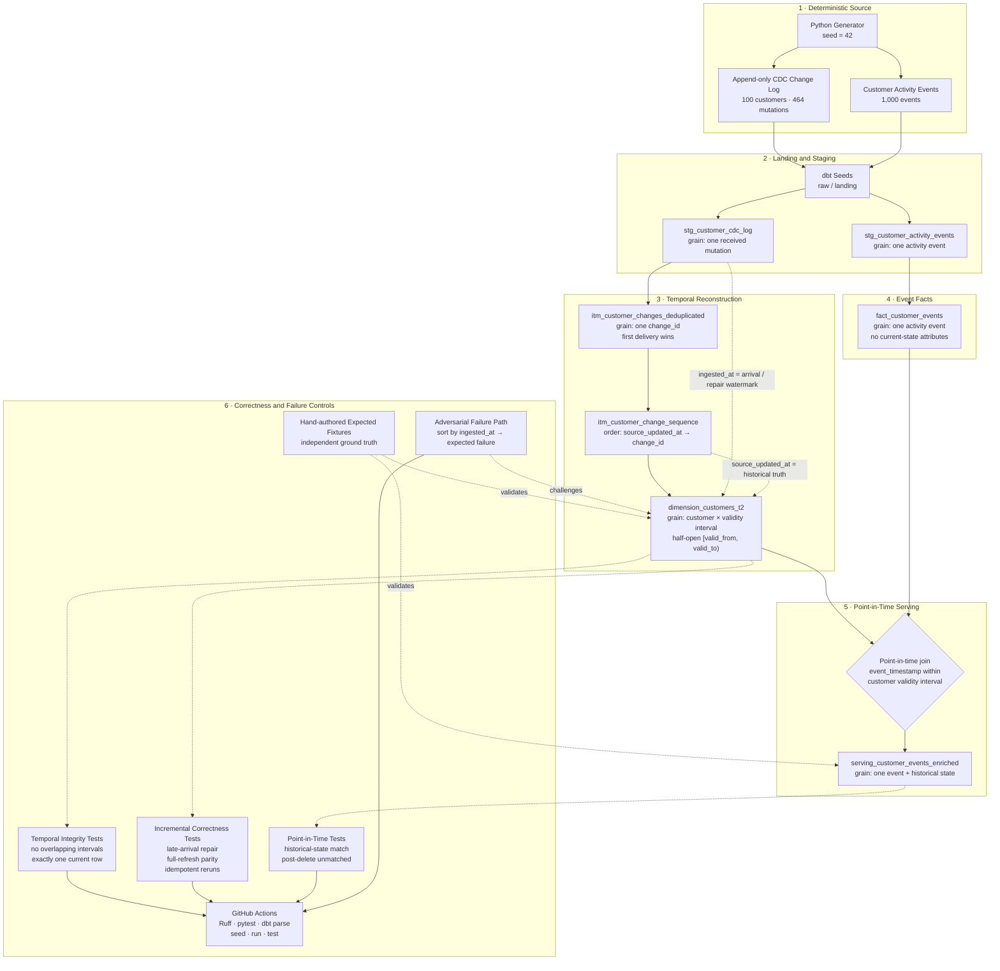

# Project Chronicle

A focused temporal correctness and CDC laboratory.

Chronicle reconstructs historically correct customer state from duplicated,
late, out-of-order, replayed, and deleted mutations, then proves that
reconstruction with point-in-time joins, temporal integrity tests,
incremental/full-refresh parity, and an ingest-order failure path.

## What it is not

- Not a production CDC platform
- Not a streaming architecture
- Not an enterprise warehouse
- Not a cloud / Airflow / Pub/Sub project

## Problem

Mutable source data arrives in an imperfect order. Downstream analytics still
needs the customer state that was true when an event happened — not the latest
row, and not the order the mutations showed up.

`source_updated_at` is when the source system changed. `ingested_at` is when
Chronicle saw the change. Those clocks diverge on purpose.

## Architecture Blueprint



The central contract is deliberate: `source_updated_at` determines historical
sequence and SCD Type 2 validity, while `ingested_at` is retained as arrival-time
metadata and the incremental-repair watermark. Activity facts remain attribute-free
until the serving layer performs the point-in-time join.

Details: [`docs/architecture.md`](docs/architecture.md).
Temporal contract: [`docs/adr/ADR-001-temporal-modeling-contract.md`](docs/adr/ADR-001-temporal-modeling-contract.md).

## Data

The deterministic generator (`seed=42`) creates:

- 100 customers
- 464 CDC mutations
- 1,000 activity events

The generated CDC and event CSVs are intentionally not committed; validation
rebuilds them from source. Hand-written expected outputs remain committed under
`fixtures/expected/` so the implementation is tested against independent ground
truth rather than expectations generated by the same code.

Customer 42 is hard-coded: Jul 1 insert, Jul 10 upgrade arrives first, Jul 8
move arrives late and duplicated, Jul 20 delete.

Regenerate with:

```bash
uv run python -m chronicle --seed 42 --out fixtures
```

## Failure scenarios

| Class | Customer | What it proves |
| --- | --- | --- |
| Late + out of order + duplicate + delete | 42 | Arrival order is not history |
| Duplicate `change_id` | 10 | First-write wins |
| Full batch replay | 11 | Replay is idempotent |
| Late arriving update | 12, 20 | Intervals are repaired |
| Out-of-order updates | 13 | Logical sort, not ingest sort |
| Stale change | 14 | Older source time cannot become current |
| Same-timestamp conflict | 18 | Tie-break by `change_id`, flag ambiguity |
| Distinct ids, identical values | 22 | Not the same as a duplicate delivery |
| Delete closes current | 21 | No tombstone row, no leftover current |

Catalog: [`fixtures/expected/scenario_catalog.yml`](fixtures/expected/scenario_catalog.yml).

## How to run

```bash
uv sync
bash scripts/validate_ci.sh
```

The validation contract generates deterministic inputs, then runs Ruff, pytest,
`dbt parse`, seed, run, and test.

## How to verify

- `tests/test_generator.py` — deterministic generator, scale, schema, scenario coverage
- `tests/test_scd2.py` — customer 42 intervals, deletes, stale, duplicates
- `tests/test_point_in_time.py` — event-time join, unmatched post-delete event
- `tests/test_incremental.py` — T1 incomplete history, T2 repair, full-refresh parity
- `tests/test_adversarial_overlap.py` — ingest-order path and injected overlap fail CI
- dbt generic tests `no_overlapping_validity_windows` and `exactly_one_current_record`

Evidence index: [`docs/validation-report.md`](docs/validation-report.md).

## Key findings

- Ingestion order cannot define historical truth. Sequencing by `ingested_at`
  creates inverted or overlapping validity windows under late arrival.
- SCD2 intervals are a function of `source_updated_at`. `ingested_at` is only
  a watermark for incremental repair.
- Duplicate delivery (`same change_id`) is not the same as two legitimate
  mutations that happen to carry the same attributes.
- Incremental correctness means rebuilding the affected customer's entire
  logical history, not appending a late row onto an already-closed timeline.
- Point-in-time joins are required; `row_current = true` rewrites the past.

## Honest limitations

- Synthetic source, not a real database transaction log
- Tiny dataset (100 customers)
- No Debezium, Datastream, or Kafka Connect
- No enterprise CDC throughput proof
- No distributed exactly-once claim
- No production SLA
- Same-timestamp conflicts are flagged and ordered by `change_id`; Chronicle
  does not claim to know which mutation "really" happened first
- Customer-scoped rebuild is correct, not a scale strategy
